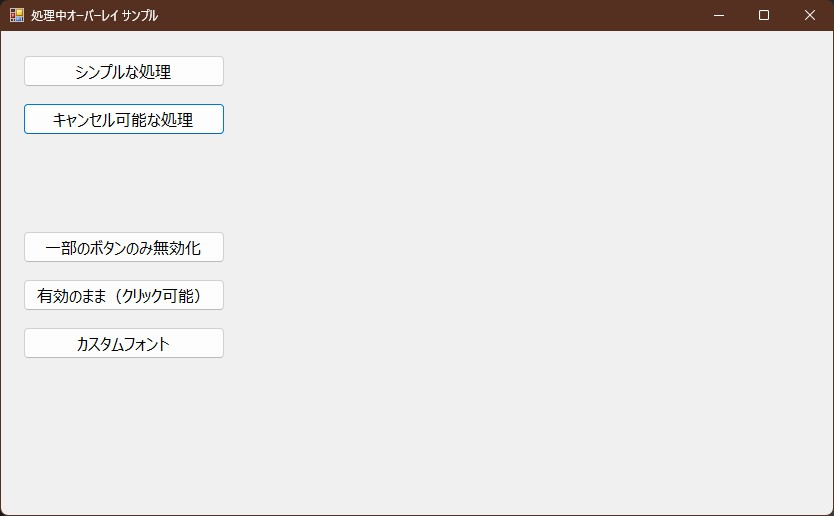
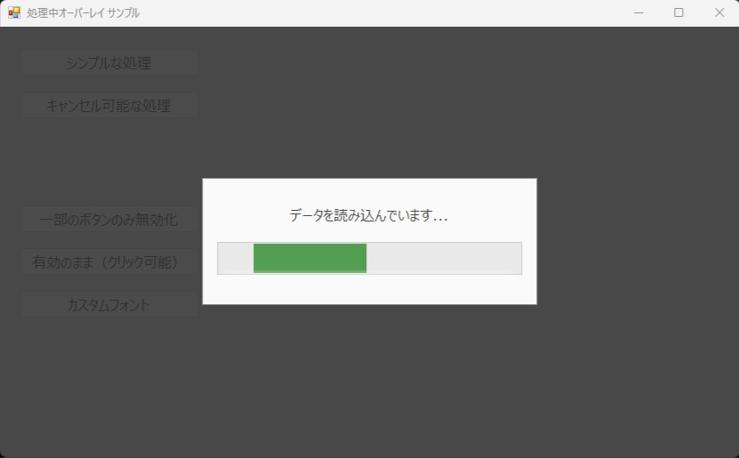
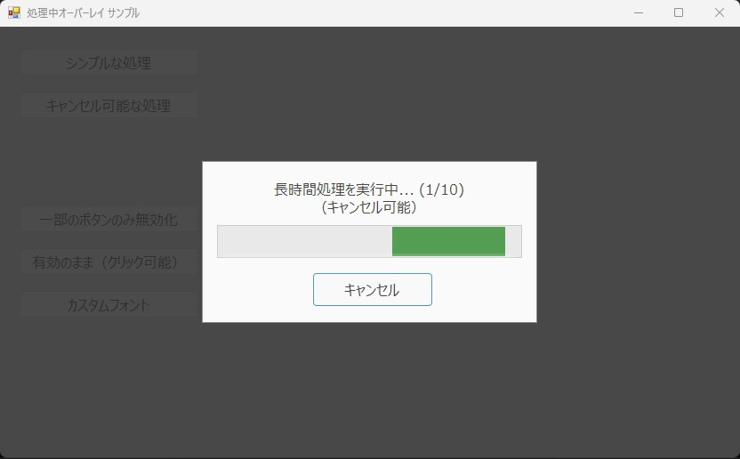

# ProgressOverlay

Windows Formsでのお手軽処理中オーバーレイ表示
------------------------------------------
* 使用方法は、SampleWinFormsApp_netfx プロジェクトを参照してください。
* .NET Framework 4.6 以降が対象 (プロジェクトは、.NET Framework 4.6 指定ですが、適宜変更してください。)

