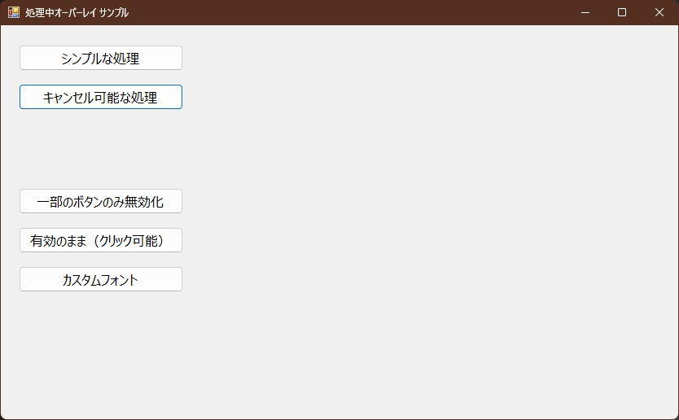
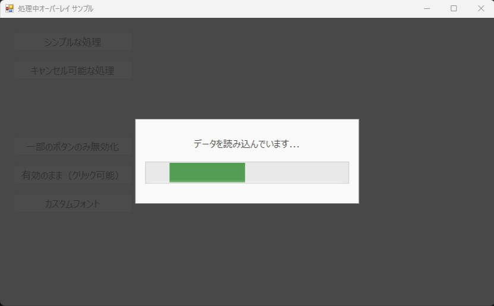
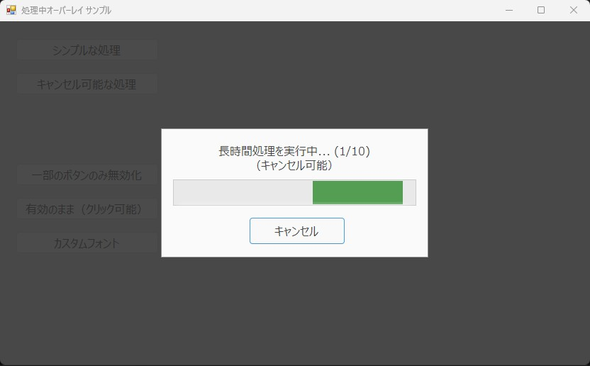

# ProgressOverlay

Windows Formsでのお手軽処理中オーバーレイ表示
------------------------------------------
* ライブラリ プロジェクト `WinFormsProgressOverlay` は、`.NET Framework 4.8` と `.NET 8 (net8.0-windows)` の両方を対象にしています。
* 使用方法は、`.NET Framework` 向けの `SampleWinFormsApp_netfx` と、`.NET 8` 向けの `SampleWinFormsApp_net8` を参照してください。
* ソリューション ファイルは `Src\ProgressOverlay\ProgressOverlay.slnx` です。

